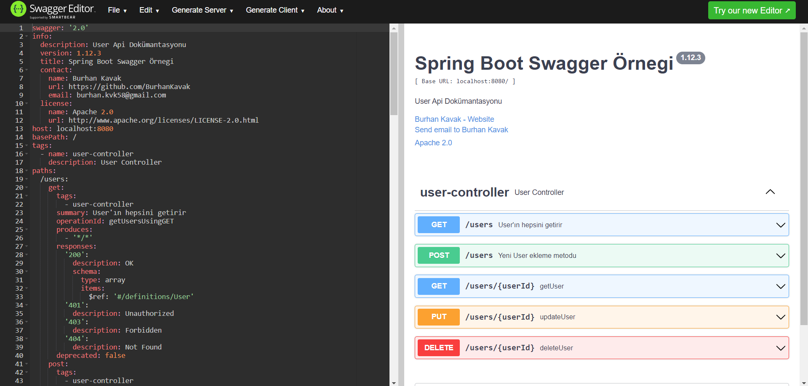
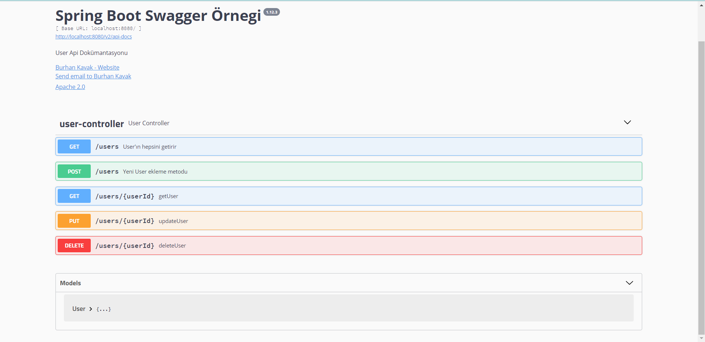
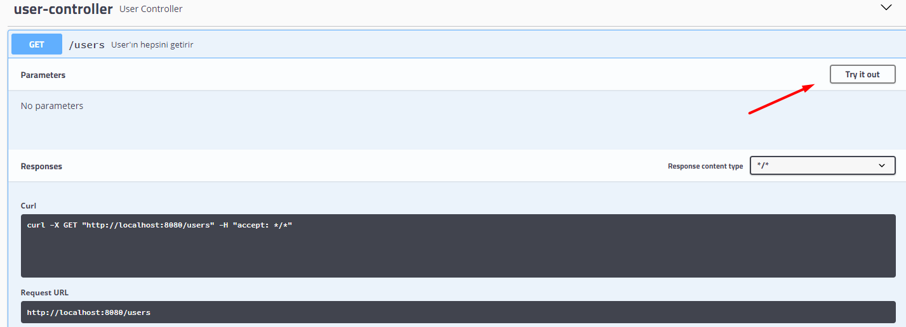
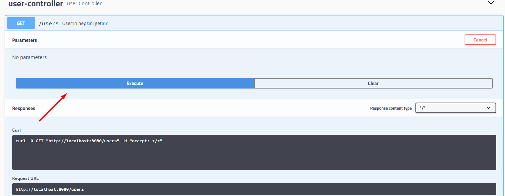
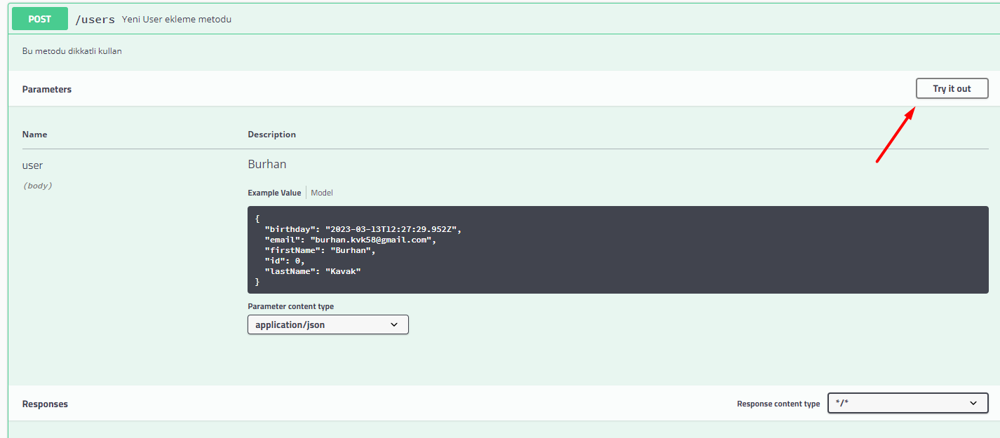
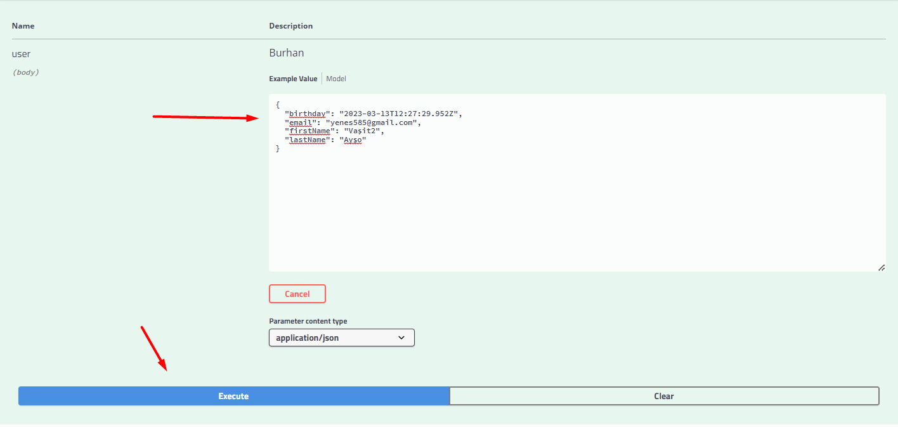
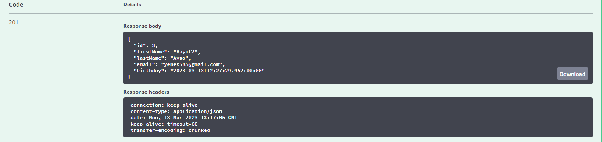

# :triangular_flag_on_post: Logger

<b> Java Spring, bir Java tabanlı bir framework'tür ve uygulamaların geliştirilmesi ve yönetilmesi için kullanılır. Bu framework, birçok bileşen içerir ve bunların birçoğu, uygulamanın davranışını izlemek, hataları tespit etmek ve sorunları gidermek için kullanılabilecek bir loglama sistemi ile birlikte gelir.</b>

Loglama, uygulamanın çalışması sırasında oluşan olayların kaydedilmesi ve saklanması işlemidir. Bu olaylar, hata mesajları, kullanıcı etkileşimleri, veritabanı işlemleri ve diğer çeşitli aktiviteleri içerebilir.

Java Spring, loglama için birçok seçenek sunar ve geliştiriciler, uygulamanın ihtiyaçlarına ve gereksinimlerine göre uygun olanı seçebilirler. Örneğin, Java Spring, Java Logging API'si, Log4j, Logback ve SLF4J gibi çeşitli loglama araçlarını destekler.</b>

## 🎯 Doğru bir loglama işlemi nasıl olmalıdır?

<b>Doğru bir loglama işlemi, uygulamanın davranışını izlemenize, hataları tespit etmenize ve sorunları gidermenize yardımcı olacak şekilde yapılandırılmalıdır. İşte doğru bir loglama işlemi için dikkat edilmesi gereken bazı faktörler: </b>

> ***Uygun loglama seviyesi belirleyin:*** Uygulamanın ihtiyaçlarına ve gereksinimlerine göre, loglama seviyesi belirlenmelidir. Bazı durumlarda, yalnızca hataların kaydedilmesi yeterli olabilirken, diğer durumlarda tüm olayların kaydedilmesi gerekebilir. Farklı loglama seviyeleri arasındaki farkları anlamak ve doğru seviyeyi belirlemek önemlidir.
>

> ***Açıklayıcı log mesajları yazın:*** Log mesajları, açıklayıcı olmalı ve sorunların tespit edilmesine yardımcı olacak şekilde yapılandırılmalıdır. Log mesajları, ne olduğunu, nerede olduğunu, ne zaman olduğunu ve kim tarafından yapıldığını açıklamalıdır. Ayrıca, hata mesajları, uygun bir hata kodu veya numarası ile birlikte yazılmalıdır.
>

> ***Loglama verilerini güvenli bir şekilde saklayın:*** Loglama verileri, uygulamanın çalışması sırasında sürekli olarak üretilebilir, bu nedenle log dosyalarının boyutu hızlı bir şekilde artabilir. Bu nedenle, log dosyalarını güvenli bir şekilde saklamak ve yedeklemek önemlidir. Ayrıca, hassas verilerin güvenliğini sağlamak için loglama dosyalarının erişimi sınırlandırılmalıdır.
>

> ***Düzenli olarak logları inceleyin:*** Loglama dosyaları düzenli olarak incelenmeli ve analiz edilmelidir. Bu, sorunları tespit etmenize, hataları gidermenize ve uygulamanın performansını izlemenize yardımcı olur. Düzenli olarak log dosyalarının analiz edilmesi, uygulamanın performansını artırabilir ve sorunları önceden tespit ederek daha büyük problemlerin önüne geçebilir.
>

> ***Loglama verilerini raporlamak:*** Loglama verileri, uygulamanın performansını raporlamak için kullanılabilir. Bu, uygulamanın performansını artırmanıza ve potansiyel sorunları önlemenize yardımcı olur. Raporlama, loglama verilerinin analiz edilmesi ve özetlenmesi anlamına gelir. Bu raporlar, uygulama geliştiricileri tarafından incelenebilir ve uygulamanın performansını geliştirmek için alınacak önlemleri belirlemeye yardımcı olabilir.
>


## 🎯 İşte yaygın olarak kullanılan bazı Java Spring loglama araçları:

1. **Log4j:** Log4j, uygulama geliştiricilerinin uygulamanın davranışını izlemesine ve sorunları tespit etmesine yardımcı olan popüler bir Java Spring loglama kütüphanesidir. Log4j, konsol, dosya ve veritabanı loglama yöntemlerini destekler.
2. **Logback:** Logback, Log4j'nin geliştirilmiş bir sürümüdür ve performansı daha iyi olduğu için tercih edilen bir loglama aracıdır. Logback, konsol, dosya ve veritabanı loglama yöntemlerini destekler.
3. **Slf4j:** Slf4j (Simple Logging Facade for Java), uygulama geliştiricilerinin uygulamanın davranışını izlemesine ve sorunları tespit etmesine yardımcı olan bir loglama aracıdır. Slf4j, loglama kütüphaneleriyle uyumlu çalışır ve farklı loglama yöntemlerini destekler.


## 🎯 Log düzeyleri nedir?
<b>Log düzeyleri, bir uygulamada kaydedilen log mesajlarının ciddiyetine göre belirlenen farklı seviyelerdir. Aşağıdaki gibi farklı log düzeyleri bulunur:</b>
1. **TRACE:** En düşük log düzeyidir ve uygulamanın her adımının izlenmesini sağlar. Genellikle uygulamanın her adımı için ayrıntılı bir loglama gerektiren durumlarda kullanılır.
2. **DEBUG:** Hata ayıklama amaçlı kullanılan bir log düzeyidir. Uygulamanın durumu, değişkenlerin değerleri ve diğer ayrıntılar hakkında bilgi sağlar.
3. **INFO:** Genel bilgi amaçlı kullanılan bir log düzeyidir. Uygulamanın durumu hakkında genel bilgi sağlar.
4. **WARN:** Uygulamada potansiyel bir hata veya sorun oluşabileceği durumlarda kullanılır. Uygulamanın normal şekilde çalışmasını engellemediği ama dikkate alınması gerektiği bir uyarı niteliği taşır.
5. **ERROR:** Uygulamada bir hata veya istisna oluştuğunda kullanılır. Bu log düzeyi, uygulamanın beklenmeyen bir şekilde sonlandığı veya öngörülemeyen bir sorunla karşılaşıldığı durumlarda kullanılır.
6. **FATAL:** En yüksek log düzeyidir ve uygulamanın tamamen çalışamaz hale geldiği durumlarda kullanılır. Bu log düzeyi, ciddi hatalar, sistem arızaları ve diğer kritik sorunlar hakkında bilgi sağlar.

<b>Bu log düzeyleri, geliştiricilerin uygulamanın farklı yönlerini izlemesine, sorunları tespit etmesine ve hata ayıklama yapmasına yardımcı olur. Log düzeyleri, uygulamanın gereksinimlerine, özelliklerine ve kullanım senaryolarına göre ayarlanmalıdır.</b>

| Düzey | Renk |
| --- | --- |
| FATAL | Kırmızı |
| ERROR | Kırmızı |
| WARN | Sarı |
| INFO | Yeşil |
| DEBUG | Yeşil |
| TRACE | Yeşil |


## :pushpin: logback bağımlılığı : Porjemizde logback kullandığımız için spring-web bize yeterli olacaktır :


```xml
<dependency>
    <groupId>org.springframework.boot</groupId>
    <artifactId>spring-boot-starter-web</artifactId>
    <version>2.2.6.RELEASE</version>
</dependency>
```

## :pushpin: Logback Logger için lazım olan logback-spring.xml dosyamız :

```xml
<?xml version="1.0" encoding="UTF-8"?>
<configuration>
    <include resource="org/springframework/boot/logging/logback/defaults.xml"/>

    <property name="LOG_PATH" value="./logs"/>

    <appender name="STDOUT" class="ch.qos.logback.core.ConsoleAppender">
        <encoder>
            <pattern>
                %d{dd-MM-yyyy HH:mm:ss.SSS} %magenta([%thread]) %highlight(%-5level) %logger{36}.%M - %msg%n
            </pattern>
        </encoder>
    </appender>

    <appender name="FILEOUT" class="ch.qos.logback.core.rolling.RollingFileAppender">
        <file>${LOG_PATH}/spring-boot-logging.log</file>
        <encoder class="ch.qos.logback.classic.encoder.PatternLayoutEncoder">
            <Pattern>%d %p %C{1.} [%t] %m%n</Pattern>
        </encoder>

        <rollingPolicy class="ch.qos.logback.core.rolling.TimeBasedRollingPolicy">
            <fileNamePattern>${LOG_PATH}/archive/spring-boot-logging-%d{yyyy-MM-dd}.%i.log</fileNamePattern>
            <timeBasedFileNamingAndTriggeringPolicy class="ch.qos.logback.core.rolling.SizeAndTimeBasedFNATP">
                <maxFileSize>10MB</maxFileSize>
            </timeBasedFileNamingAndTriggeringPolicy>
        </rollingPolicy>
    </appender>

    <springProfile name="dev">
        <root level="info">
            <appender-ref ref="STDOUT"/>
            <appender-ref ref="FILEOUT"/>
        </root>
        <logger name="com.example.springbootcrud.service" additivity="false" level="debug">
            <appender-ref ref="STDOUT"/>
            <appender-ref ref="FILEOUT"/>
        </logger>
    </springProfile>

    <springProfile name="prod">
        <root level="error">
            <appender-ref ref="FILEOUT"/>
        </root>
        <logger name="com.example.springbootcrud.service" additivity="false" level="debug">
            <appender-ref ref="FILEOUT"/>
        </logger>
    </springProfile>
</configuration>
```


## :triangular_flag_on_post: Swagger Nedir?

<b> Spring Swagger, Spring Framework ve Swagger araçlarının birleşimidir. Spring Framework, Java dilinde web uygulamaları geliştirmek için kullanılan açık kaynaklı bir platformdur. Swagger ise RESTful web servisleri için açık kaynaklı bir araçtır ve API'lerin belgelenmesi, test edilmesi ve keşfedilmesi için kullanılır.</b>

<b> Spring Swagger, Spring Framework üzerinde çalışan RESTful web servislerin Swagger aracılığıyla otomatik olarak belgelendirilmesini sağlar. Bu, API'lerin nasıl kullanılacağı, hangi parametrelerin geçirileceği ve hangi sonuçların beklenmesi gerektiği gibi bilgileri açıklayan bir kullanım kılavuzu sağlar.</b>

<b> Spring Swagger, RESTful web servisleri geliştiren ve bu servislerin doğru bir şekilde belgelendirilmesini isteyen geliştiriciler için oldukça kullanışlı bir araçtır. Bu araç, API'lerin belgelendirilmesi sürecini kolaylaştırır ve Swagger sayesinde API'lerin test edilmesi ve keşfedilmesi daha kolay hale gelir.</b><br><br>


<b> Swagger UI tarafından kullanılabilecek ve RESTful web servislerin belgelendirilmesi için kullanılabilecek bir dizi anotasyona sahiptir. Bu anotasyonlar, Spring Framework üzerinde çalışan web uygulamalarında kullanılabilir ve Swagger belgelerinin oluşturulmasına yardımcı olur. Bazı yaygın Spring Swagger anotasyonları aşağıdaki gibidir:</b>

1. **@Api:** Controller veya Controller sınıfı seviyesinde kullanılır ve API hizmetinin bir parçası olarak belirtilir.
2. **@ApiOperation:** Bir işlemi belgelemek için kullanılır. Bu anotasyon, işlemin adı, açıklaması, parametreleri, yanıtı ve hata durumlarını tanımlamanıza olanak tanır.
3. **@ApiParam:** İşlemlerdeki parametreleri belgelemek için kullanılır.
4. **@ApiResponse:** İşlemlerden birinin yanıtını belgelemek için kullanılır.
5. **@ApiModel:** Bir veri modelini belgelemek için kullanılır.
6. **@ApiModelProperty:** Bir veri modelinin özelliklerini belgelemek için kullanılır.
7. **@ApiIgnore:** Belgeleme için kullanılmayan bir öğeyi işaretlemek için kullanılır. Örneğin, geçici bir değişkeni veya bir test yöntemini belgelemeyebilirsiniz.

<b> Bu anotasyonlar, Spring Swagger ile birlikte kullanılarak RESTful web servislerin belgelenmesini kolaylaştırır ve Swagger UI tarafından kullanılacak bir Swagger belgesi oluşturmanıza olanak tanır.</b>


## :pushpin: swagger bağımlılığı : swagger kullanabilmemiz için bu bağımlılığı eklemeliyiz

```xml
<dependency>
    <groupId>io.springfox</groupId>
    <artifactId>springfox-swagger2</artifactId>
    <version>2.9.2</version>
    <scope>compile</scope>
</dependency>
```
<b><p>localhost'da bağlantı yaparken kök uzantısına bu eklentiyi de eklersek (/v2/api-docs)
bize XML formatında bir çıktı verir onu da swagger editor kısmına yapıştırırsak bu proje özelinde şu şekilde bir çıktı elde ederiz :</b>




<b> <p> Bu şekilde uğraşmak yerine yeni bir bağımlılık ekleyerek swagger-ui kısmında direkt istediğimiz modeller ve metodlara ulaşabiliriz </p></b>

## :pushpin: swagger-ui bağımlılığı : swaggeri daha rahat kullanabilmemiz için gereken bağımlılık :

```xml
<dependency>
    <groupId>io.springfox</groupId>
    <artifactId>springfox-swagger-ui</artifactId>
    <version>2.9.2</version>
</dependency>
```

http://localhost:8080/swagger-ui.html uzantısı ile swagger-ui'a ulaşabiliriz




## Swagger Nasıl kullanılır?


### Get ve Post için örnek yapacak olursak yeterli olacaktır :

### GET





### POST








### 🎯 Swagger Not : 

<p><b>Swaggerin bir üst modeli olan 3.Versiyon Swagger Open API kullanmaya başlıyoruz bu projede onun için bir bağımlılığa ihtiyacımız olacak :</b></p>

```xml
<dependency>
    <groupId>org.springdoc</groupId>
    <artifactId>springdoc-openapi-ui</artifactId>
    <version>1.6.4</version>
</dependency>
```


